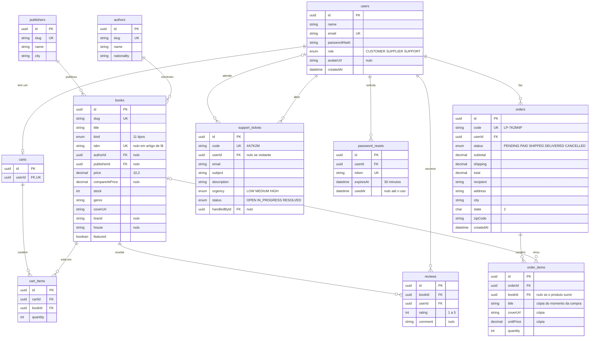
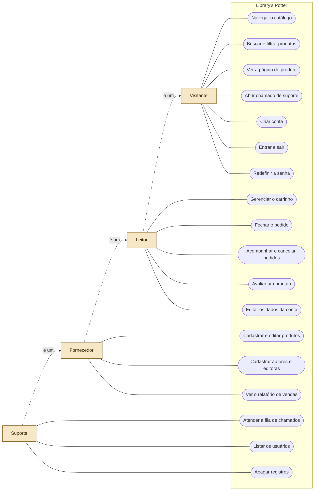
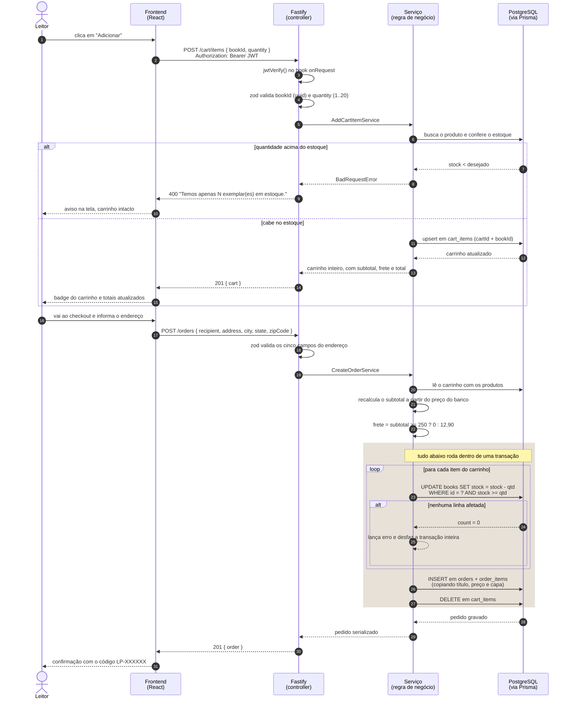

# Documentação — Library's Potter

Documentação de engenharia de software do e-commerce Library's Potter, livraria e loja do mundo
bruxo da saga Harry Potter. O sistema é a reconstrução de um trabalho anterior em PHP/MySQL, que
segue preservado em `legacy/` e serve de referência do que a loja precisava fazer.

| | |
|---|---|
| **Autores** | Arthur Roberto Weege Pontes · Guilherme Silveira · Lucas Alves |
| **Versão** | 1.0 |
| **Data** | Setembro de 2026 |
| **Repositório** | `backend/` (API), `frontend/` (interface), `legacy/` (projeto antigo) |
| **Documentos irmãos** | [Arquitetura](02-arquitetura.md) · [Plano de testes](03-plano-de-testes.md) |

---

## 1. Visão geral do sistema

### 1.1 Objetivo

Vender produtos pela internet com segurança e rapidez: o visitante encontra o produto, coloca no
carrinho, informa o endereço e fecha o pedido; a loja acompanha o estoque, as vendas e os chamados
de atendimento em um painel próprio.

### 1.2 Público-alvo

O sistema tem três papéis de usuário, herdados do site antigo e mantidos no enum `Role`:

| Papel | Enum | O que faz |
|---|---|---|
| Leitor (cliente final) | `CUSTOMER` | Navega o catálogo, compra, avalia produtos e abre chamados |
| Fornecedor | `SUPPLIER` | Tudo do leitor, mais o cadastro de produtos, autores e editoras e o relatório de vendas |
| Suporte | `SUPPORT` | Tudo do fornecedor, mais a fila de chamados, a lista de usuários e o direito exclusivo de apagar registros |

Visitante sem conta também é um ator: ele navega o catálogo inteiro, vê preço e avaliação e abre
chamado na central de ajuda. Só carrinho, pedido e avaliação exigem login.

### 1.3 Escopo

**Dentro do escopo**

- Catálogo com 142 produtos em sete departamentos, com busca, filtros, ordenação e paginação por limite
- Cadastro, login, sessão por JWT e redefinição de senha por token
- Carrinho guardado no servidor, com regra de frete
- Checkout com endereço de entrega, baixa de estoque transacional e histórico de pedidos
- Avaliações com nota e comentário, com selo de compra verificada
- Central de ajuda com abertura e atendimento de chamados
- Painel administrativo com CRUD de catálogo e relatório de vendas
- Acessibilidade: paletas para daltonismo, alto contraste, tema claro, tamanho de texto, fonte de leitura fácil e movimento reduzido

**Fora do escopo (e por quê)**

| Item | Situação | Motivo |
|---|---|---|
| Gateway de pagamento real | Simulado | Projeto acadêmico. O pedido nasce com status `PAID`; a tela de checkout avisa em texto que o pagamento é simulado e que nenhum dado de cartão é pedido |
| Cálculo de frete por CEP | Regra fixa | O CEP é coletado e gravado no pedido, mas o valor sai de uma regra própria (R$ 12,90, grátis acima de R$ 250), sem consultar Correios ou Melhor Envio |
| Envio de e-mail transacional | Não implementado | Não há servidor de e-mail. Fora de produção, o token de redefinição volta na própria resposta da API para o fluxo poder ser testado inteiro |
| HTTPS | Não aplicável localmente | O sistema roda em `localhost` sobre HTTP. O que depende de HTTPS já está preparado: o cookie de sessão recebe `Secure` quando `NODE_ENV=production` e o Helmet já envia HSTS |

Essas quatro lacunas são conscientes e estão medidas no [plano de testes](03-plano-de-testes.md),
com o caminho de implementação descrito na seção 7 daquele documento.

---

## 2. Requisitos de software

### 2.1 Requisitos funcionais

Cada requisito aponta para o endpoint que o cumpre e para o caso de teste que o comprova.

| ID | Requisito | Onde está | Teste |
|---|---|---|---|
| RF-01 | O usuário deve conseguir criar uma conta escolhendo um dos três papéis | `POST /auth/register` | CT-01, CT-04 |
| RF-02 | O sistema deve recusar cadastro com e-mail já usado | `POST /auth/register` | CT-02 |
| RF-03 | O usuário deve conseguir entrar com e-mail e senha e receber uma sessão | `POST /auth/login` | LG-01 |
| RF-04 | O usuário deve conseguir sair e encerrar a sessão | `POST /auth/logout` | LG-06 |
| RF-05 | O usuário deve conseguir pedir e usar um link de redefinição de senha, uma única vez | `POST /auth/forgot-password`, `POST /auth/reset-password` | RS-01 a RS-05 |
| RF-06 | O cliente deve ter um painel com seus pedidos, avaliações, chamados e dados da conta | `GET /auth/me`, `GET /profile`, `GET /orders`, `GET /reviews/me`, `GET /support/tickets/me` | LG-05 |
| RF-07 | O sistema deve permitir buscar produtos por nome, autor ou ISBN | `GET /catalog/books?search=` | BF-02, BF-03 |
| RF-08 | O sistema deve permitir filtrar por departamento, tipo, marca, casa, gênero, faixa de preço, estoque e promoção | `GET /catalog/books` | BF-04, BF-05, BF-11 |
| RF-09 | O sistema deve permitir ordenar por relevância, preço, título, novidade, nota e desconto | `GET /catalog/books?sort=` | BF-05 |
| RF-10 | O cliente deve conseguir adicionar, alterar a quantidade e remover itens do carrinho | `POST/PATCH/DELETE /cart/items` | CR-03 a CR-07 |
| RF-11 | O carrinho não pode aceitar quantidade maior que o estoque | `POST /cart/items` | CR-06 |
| RF-12 | O cliente deve conseguir fechar a compra informando o endereço de entrega | `POST /orders` | CK-05 |
| RF-13 | O fechamento do pedido deve baixar o estoque e esvaziar o carrinho | `POST /orders` | CK-06, CK-07 |
| RF-14 | O cliente deve conseguir cancelar um pedido ainda não enviado, devolvendo os itens ao estoque | `PATCH /orders/:id/cancel` | CK-09, CK-10 |
| RF-15 | O cliente deve conseguir avaliar um produto com nota e comentário, uma avaliação por produto | `POST /reviews/books/:slug` | AV-01, AV-02 |
| RF-16 | Qualquer pessoa, com ou sem conta, deve conseguir abrir um chamado de suporte | `POST /support/tickets` | SP-01 |
| RF-17 | O administrador deve conseguir cadastrar, atualizar e remover produtos, autores e editoras | `POST/PATCH/DELETE /admin/*` | AD-02, AD-04 |
| RF-18 | O administrador deve ver um relatório de vendas com faturamento, ticket médio, mais vendidos e estoque baixo | `GET /admin/sales` | AD-06 |
| RF-19 | Só o suporte pode apagar registros, ver a lista de usuários e atender a fila de chamados | guards de papel nas rotas | AD-01, AD-04, SP-04 |
| RF-20 | Os filtros aplicados devem viver na URL, para a tela poder ser compartilhada e sobreviver ao recarregamento | `frontend/src/pages/Catalog.tsx` | BF-12 |

### 2.2 Requisitos não funcionais

| ID | Requisito | Como foi verificado | Resultado |
|---|---|---|---|
| RNF-01 | As páginas principais devem carregar em menos de 3 segundos | Medição do build de produção, três rodadas por página | Pior caso 476 ms na Home (primeiro acesso, cache frio). Ver UD-02 |
| RNF-02 | A API deve responder as consultas de catálogo em menos de 500 ms | 15 chamadas por rota, mediana | Entre 2 ms e 25 ms. Ver UD-03 |
| RNF-03 | O sistema deve ficar no ar 99,9% do tempo | Não medível em ambiente local. A app é construída por `buildApp()` sem abrir porta, o que permite subir várias instâncias atrás de um balanceador sem mudar código | Preparado, não medido |
| RNF-04 | Senhas nunca podem ser guardadas ou trafegadas em texto puro | Consulta direta ao banco e inspeção de todas as respostas da API | bcrypt `$2a$`, custo 10, 60 caracteres. Nenhuma resposta contém o hash. Ver SG-04, SG-05 |
| RNF-05 | Dados de cartão de crédito devem seguir o PCI-DSS | O sistema não coleta, não trafega e não guarda dado de cartão: não existe campo de cartão em nenhum formulário nem coluna no banco | Fora do escopo do PCI-DSS por não tocar no dado. Ver SG-08 |
| RNF-06 | Dados pessoais devem seguir a LGPD | O cadastro pede nome, e-mail e senha; o endereço só é pedido no checkout e fica gravado no pedido. Não há rastreador de terceiros nem venda de dados | Atende ao princípio da necessidade |
| RNF-07 | O site deve funcionar em celular e computador | Sete páginas medidas em oito larguras, de 360 px a 1920 px | Um defeito aberto: DEF-01, estouro horizontal do catálogo abaixo de 420 px. Ver UD-01 |
| RNF-08 | O site deve ser usável por quem tem baixa visão, daltonismo ou sensibilidade a movimento | Página `/configuracoes` com sete preferências gravadas no navegador | Atende |
| RNF-09 | A API deve resistir a força bruta de login | Limite de 200 requisições por minuto por IP | Bloqueio confirmado na requisição 200, com `Retry-After: 60`. Ver SG-11 |
| RNF-10 | O código deve ter cobertura automatizada de regressão | Suítes de backend e frontend | 96 testes automatizados, todos passando. Ver seção 5 do plano de testes |

---

## 3. Arquitetura do sistema

Resumo. O detalhamento completo, com diagrama de componentes, contrato de cada endpoint e as
decisões de projeto, está em [02-arquitetura.md](02-arquitetura.md).

| Camada | Tecnologia | Papel |
|---|---|---|
| Frontend | React 19, Vite 8, Tailwind 4, TypeScript | O que o cliente vê. 18 telas, carregadas sob demanda |
| Backend | Node 20+, Fastify 5, Prisma 6, TypeScript, zod | Regras de negócio. 44 endpoints REST em 8 grupos, mais `/health` |
| Banco de dados | PostgreSQL 17 | 11 tabelas com relações declaradas e migrations versionadas |
| Integrações externas | Nenhuma em produção | Pagamento e frete são simulados; ver 1.3 |

---

## 4. Modelagem de dados

### 4.1 Entidades principais

**Usuário** (`users`) — id (uuid), nome, e-mail (único), hash da senha, papel, foto, criado em,
atualizado em. Um usuário tem um carrinho, muitos pedidos, muitas avaliações e muitos chamados.

**Produto** (`books`) — id, slug (único), título, tipo, ISBN (único, nulo em artigo que não é
livro), autor, editora, data de publicação, preço, estoque, gênero, sinopse, trecho, capa,
páginas, idioma, destaque, posição, marca, preço de tabela, casa, personagem e etiquetas.

A tabela se chama `books` porque nasceu como livraria. Hoje ela guarda os onze tipos do enum
`ProductKind`, e artigo que não é livro tem autor, editora e ISBN nulos de propósito.

**Pedido** (`orders`) — id, código legível (`LP-7K2M4P`), usuário, status, subtotal, frete, total,
destinatário, endereço, cidade, estado, CEP, criado em, atualizado em.

**Item do pedido** (`order_items`) — id, pedido, produto (pode ficar nulo), título, capa, preço
unitário e quantidade. O título, o preço e a capa ficam **copiados** aqui: editar o catálogo
depois não reescreve o que a pessoa comprou.

As outras sete tabelas são `password_resets`, `authors`, `publishers`, `reviews`, `carts`,
`cart_items` e `support_tickets`.

### 4.2 Diagrama de entidade-relacionamento



Três restrições de integridade que valem citar:

- `reviews` tem chave única em (`bookId`, `userId`): a segunda avaliação do mesmo leitor no mesmo
  produto **edita** a primeira em vez de duplicar.
- `cart_items` tem chave única em (`cartId`, `bookId`): adicionar o mesmo produto duas vezes soma
  na mesma linha.
- `order_items.bookId` é `ON DELETE SET NULL`, e `books.authorId`/`publisherId` são `ON DELETE
  RESTRICT`: apagar um autor que ainda tem livros é recusado, e apagar um produto já vendido não
  destrói o histórico do pedido.

### 4.3 Diagrama de casos de uso



As setas tracejadas são herança de ator: o fornecedor faz tudo o que o leitor faz, e o suporte faz
tudo o que o fornecedor faz. É por isso que os guards de rota são `authorize(['SUPPLIER',
'SUPPORT'])` para o catálogo e `authorize(['SUPPORT'])` para o que só o suporte pode.

### 4.4 Diagrama de sequência — uma compra do clique ao pedido pago



O bloco destacado é o que impede dois pedidos simultâneos de venderem o mesmo último exemplar: a
conferência e a baixa acontecem na mesma instrução `UPDATE ... WHERE stock >= qtd`, e não em um
`SELECT` seguido de um `UPDATE`. Se qualquer item falhar, a transação inteira é desfeita e nenhum
estoque foi mexido.

O cancelamento faz o caminho inverso na mesma estrutura: devolve os exemplares e muda o status para
`CANCELLED`, também dentro de uma transação.

---

## 5. Instalação e execução

Requer Node 20 ou superior e PostgreSQL 17 em `localhost:5432`.

```bash
# 1. bancos (o segundo é usado só pelos testes)
psql -U postgres -c "CREATE DATABASE librarys_potter;"
psql -U postgres -c "CREATE DATABASE librarys_potter_test;"

# 2. backend
cd backend
npm install
npx prisma migrate deploy    # cria as 11 tabelas
npm run db:seed              # popula com 142 produtos e 26 usuários
npm run dev                  # http://localhost:3334

# 3. frontend
cd frontend
npm install
npm run dev                  # http://localhost:5174
```

O Vite faz proxy de `/api` para a porta 3334, então basta abrir <http://localhost:5174>.

### Contas semeadas

Todas com a senha `libraryspotter`.

| Papel | E-mail |
|---|---|
| Leitor | `agostinhocarrara@gmail.com` |
| Fornecedor | `japalivros@gmail.com` |
| Suporte | `memphisdepay@gmail.com` |

---

## 6. Glossário

| Termo | O que é aqui |
|---|---|
| Departamento | Um dos sete corredores da loja. É um agrupamento dos onze valores do enum `ProductKind`, definido em um lugar só: a constante `DEPARTMENTS` de `catalog-service.ts` |
| Casa | Grifinória, Sonserina, Corvinal ou Lufa-Lufa. Além de ser filtro de produto, a casa escolhida repinta o site inteiro |
| Slug | Identificador legível na URL, como `harry-potter-e-a-pedra-filosofal`. É o que a página de produto recebe, e não o uuid |
| Compra verificada | Selo na avaliação de quem tem um pedido com aquele produto |
| Preço de tabela | O `compareAtPrice`. Quando existe e é maior que o preço, o cartão mostra o desconto. O total do pedido sai sempre do `price` |
