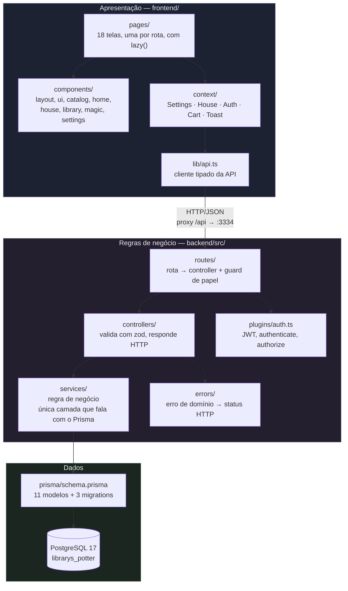
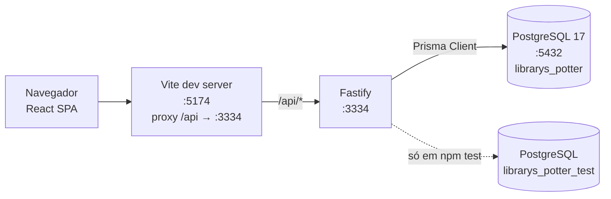

# Arquitetura do software — Library's Potter

Como o sistema é organizado, quem conversa com quem e por que foi feito assim.

| | |
|---|---|
| **Autores** | Arthur Roberto Weege Pontes · Guilherme Silveira · Lucas Alves |
| **Estilo arquitetural** | Três camadas (apresentação, negócio, dados) com MVC dentro do servidor e cliente/servidor separados |
| **Documentos irmãos** | [Documentação](01-documentacao.md) · [Plano de testes](03-plano-de-testes.md) |

---

## 1. Visão em camadas



Duas regras que o código segue em todo lugar, e que valem como critério de revisão:

1. **Controller não chama o Prisma.** Ele valida a entrada, chama um serviço e devolve o status
   HTTP. Se um controller precisar de dados, ele pede a um serviço.
2. **Serviço não conhece HTTP.** Ele não recebe `request`, não devolve `reply` e não sabe o que é
   um código 404. Quando algo dá errado, ele lança um erro de domínio (`NotFoundError`,
   `BadRequestError`, `ConflictError`), e `handleError` traduz para status.

O ganho prático é que a regra de negócio pode ser chamada de qualquer lugar — outro endpoint, um
script de carga, um teste — sem carregar uma requisição HTTP falsa junto.

---

## 2. Componentes essenciais

| Componente | Onde | Responsabilidade |
|---|---|---|
| **Ponto de entrada da API** | `backend/src/app.ts` | Monta a aplicação com Helmet, CORS, cookie, rate limit, JWT e as rotas. `buildApp()` devolve a app **sem abrir porta**, o que deixa os testes usarem `app.inject()` e permitiria subir várias instâncias atrás de um balanceador |
| **Serviço de produtos** | `services/catalog-service.ts` | Catálogo, filtros, ordenação, desconto, departamentos, recomendações e a agregação de notas. É quem define a constante `DEPARTMENTS`, o único lugar onde os onze tipos viram sete corredores |
| **Serviço de clientes** | `services/auth-service.ts`, `services/profile-service.ts` | Cadastro, autenticação, redefinição de senha por token e os dados da conta |
| **Serviço de carrinho** | `services/cart-service.ts` | Carrinho no servidor, conferência de estoque e a regra de frete. Toda mutação devolve o carrinho **inteiro**, então os totais da tela nunca divergem da API |
| **Serviço de pedidos** | `services/order-service.ts` | Fechamento, listagem e cancelamento, com a baixa e a devolução de estoque dentro de transação |
| **Serviço de avaliações** | `services/review-service.ts` | Avaliação por leitor por produto, com selo de compra verificada |
| **Serviço de suporte** | `services/support-service.ts` | Abertura de chamado (com ou sem conta), fila e atendimento |
| **Serviço administrativo** | `services/admin-service.ts` | CRUD de catálogo, relatório de vendas e lista de usuários |
| **Guardas de acesso** | `plugins/auth.ts` | `authenticate` exige sessão válida; `authorize([papéis])` exige papel. Ficam **nas rotas**, nunca dentro dos serviços |
| **Tradutor de erros** | `errors/index.ts` | Converte `ZodError` em 400 com `issues` campo a campo, e erro de domínio no status dele. Qualquer outra coisa vira 500 com log e sem vazar detalhe interno |

### Sobre o gateway de API

O trabalho pede um "gateway de API: o ponto de entrada único que recebe as requisições do site e
direciona para os serviços corretos". Aqui esse papel é do próprio Fastify: `registerRoutes` em
`routes/index.ts` é o ponto único onde os oito grupos são registrados com seus prefixos, e é ali
que uma rota nova entra.

Um gateway separado (Kong, Nginx, API Gateway) só se paga quando existem vários serviços
independentes para rotear. Com um serviço só, ele adicionaria um salto de rede e uma peça a mais
para manter, sem resolver problema nenhum. O caminho de crescimento, se o projeto virasse
microsserviços, seria promover `routes/index.ts` a gateway e mover cada grupo para o seu próprio
processo — a separação por grupo já está feita.

---

## 3. Implantação e portas



A porta 3334 é escolhida: outro projeto usa a 3333, e assim os dois rodam ao mesmo tempo. O
frontend fica na 5174 pelo mesmo motivo.

O proxy do Vite existe para o navegador ficar em **uma origem só** durante o desenvolvimento. Sem
ele, toda chamada seria cross-origin e o cookie de sessão precisaria de `SameSite=None`, que só
funciona sobre HTTPS.

Os testes de backend usam um banco separado, `librarys_potter_test`. O `global-setup` aplica as
migrations com `prisma migrate deploy` e roda o seed, que limpa as tabelas antes de popular. Como
as suítes compartilham o mesmo banco, `fileParallelism` fica desligado.

---

## 4. A API REST

44 endpoints em 8 grupos, mais `/health`. Todos respondem JSON. Erro sempre volta como
`{ error, code }`, e erro de validação traz `issues` com a lista de problemas por campo.

### 4.1 Autenticação e usuários

| Método | Rota | Acesso | O que faz |
|---|---|---|---|
| POST | `/auth/register` | público | Cria a conta escolhendo o papel e já devolve o token |
| POST | `/auth/login` | público | Autentica e devolve o JWT, gravando também o cookie `token` |
| POST | `/auth/logout` | público | Limpa o cookie de sessão |
| POST | `/auth/forgot-password` | público | Gera o token de redefinição, válido por 30 minutos |
| POST | `/auth/reset-password` | público | Troca a senha e marca o token como usado |
| GET | `/auth/me` | sessão | Perfil do usuário logado, com as estatísticas dele |
| GET | `/profile` | sessão | Dados da conta |
| PATCH | `/profile` | sessão | Atualiza nome, e-mail e foto |
| PATCH | `/profile/password` | sessão | Troca a senha informando a atual |

### 4.2 Produtos e categorias

| Método | Rota | Acesso | O que faz |
|---|---|---|---|
| GET | `/catalog/books` | público | Lista com busca e 15 filtros (ver 4.3) |
| GET | `/catalog/books/:slug` | público | Produto com sinopse, ficha, notas, avaliações e recomendações |
| GET | `/catalog/authors` | público | Autores com contagem de livros |
| GET | `/catalog/publishers` | público | Editoras com contagem |
| GET | `/catalog/genres` | público | Gêneros com contagem |
| GET | `/catalog/brands` | público | Marcas com contagem |
| GET | `/catalog/departments` | público | Os sete corredores, com contagem e faixa de preço |

### 4.3 Parâmetros de `GET /catalog/books`

Todos opcionais e validados por zod. Um valor fora da lista devolve 400, não um resultado vazio
silencioso.

| Parâmetro | Tipo | Observação |
|---|---|---|
| `search` | texto, 1–120 | Casa com título, autor e ISBN |
| `department` | texto | Um dos sete corredores |
| `kind` | enum | Um dos onze valores de `ProductKind` |
| `genre`, `brand`, `character`, `tag` | texto | |
| `house` | enum | `grifinoria`, `sonserina`, `corvinal`, `lufa-lufa` |
| `author`, `publisher` | texto | Slug |
| `minPrice`, `maxPrice` | número | |
| `featured`, `inStock`, `onSale` | booleano | |
| `limit` | inteiro, até 200 | |
| `sort` | enum | `relevance`, `price-asc`, `price-desc`, `title`, `newest`, `rating`, `discount` |

O produto já chega ao frontend com o `department` resolvido e o `discount` calculado em pontos
percentuais. O frontend **não** repete essas contas.

### 4.4 Carrinho

| Método | Rota | Acesso | O que faz |
|---|---|---|---|
| GET | `/cart` | sessão | Carrinho com itens, subtotal, frete, total e quanto falta para o frete grátis |
| POST | `/cart/items` | sessão | Adiciona ou soma na linha existente |
| PATCH | `/cart/items/:itemId` | sessão | Altera a quantidade; zero remove a linha |
| DELETE | `/cart/items/:itemId` | sessão | Remove a linha |
| DELETE | `/cart` | sessão | Esvazia |

### 4.5 Pedidos

| Método | Rota | Acesso | O que faz |
|---|---|---|---|
| POST | `/orders` | sessão | Fecha o carrinho em pedido, com endereço de entrega |
| GET | `/orders` | sessão | Histórico do usuário logado |
| GET | `/orders/:orderId` | sessão | Um pedido, só se for do próprio usuário |
| PATCH | `/orders/:orderId/cancel` | sessão | Cancela e devolve os itens ao estoque |

### 4.6 Avaliações e suporte

| Método | Rota | Acesso | O que faz |
|---|---|---|---|
| GET | `/reviews/me` | sessão | Minhas avaliações |
| POST | `/reviews/books/:slug` | sessão | Avalia; a segunda edita a primeira |
| DELETE | `/reviews/:id` | sessão | Apaga a própria avaliação |
| POST | `/support/tickets` | **público** | Abre chamado, com ou sem conta |
| GET | `/support/tickets/me` | sessão | Meus chamados |
| GET | `/support/tickets` | SUPPORT | A fila, por status e urgência |
| GET | `/support/summary` | SUPPORT | Resumo da fila |
| PATCH | `/support/tickets/:id` | SUPPORT | Atende e resolve |

### 4.7 Painel administrativo

| Método | Rota | Acesso | O que faz |
|---|---|---|---|
| POST | `/admin/books` | SUPPLIER, SUPPORT | Cadastra produto |
| PATCH | `/admin/books/:id` | SUPPLIER, SUPPORT | Atualiza produto ou estoque |
| DELETE | `/admin/books/:id` | **SUPPORT** | Remove; produto já vendido tem o estoque zerado em vez de apagado |
| POST/PATCH | `/admin/authors`, `/admin/publishers` | SUPPLIER, SUPPORT | Cadastra e atualiza |
| DELETE | `/admin/authors/:id`, `/admin/publishers/:id` | **SUPPORT** | Recusado se ainda houver livros ligados |
| GET | `/admin/sales` | SUPPLIER, SUPPORT | Faturamento, ticket médio, mais vendidos, estoque baixo, últimos pedidos |
| GET | `/admin/users` | **SUPPORT** | Lista de usuários, sem hash de senha |

### 4.8 Endpoints que o enunciado cita e que não existem aqui

| Endpoint sugerido | Situação |
|---|---|
| `POST /api/checkout/shipping` | Não existe. O frete sai de uma regra fixa aplicada em `cart-service.ts`, sem consulta a transportadora. O CEP é coletado e gravado no pedido |
| `POST /api/orders/webhook` | Não existe. Não há gateway de pagamento para chamar de volta. O pedido nasce com status `PAID` |

O caminho para implementar os dois está na seção 7 do [plano de testes](03-plano-de-testes.md).

---

## 5. Segurança na arquitetura

| Camada | Medida | Onde |
|---|---|---|
| Transporte | Helmet com HSTS, `X-Frame-Options`, `X-Content-Type-Options` e `Referrer-Policy` | `app.ts` |
| Sessão | JWT assinado (HS256), validade de 7 dias, também gravado em cookie `HttpOnly` + `SameSite=Lax`, com `Secure` quando `NODE_ENV=production` | `plugins/auth.ts`, `auth-controller.ts` |
| Senha | bcrypt com custo 10. O hash nunca sai em resposta nenhuma | `utils/password.ts` |
| Autorização | Guards por papel nas rotas, nunca nos serviços | `plugins/auth.ts` |
| Entrada | zod em todo controller, com whitelist de campos. Parâmetro fora da lista é 400 | `controllers/` |
| Banco | Prisma Client, que parametriza toda consulta. Não há SQL montado por concatenação | `services/` |
| Força bruta | Rate limit de 200 requisições por minuto por IP | `app.ts` |
| Configuração | `env.ts` valida as variáveis de ambiente com zod na subida e recusa `JWT_SECRET` com menos de 16 caracteres | `config/env.ts` |
| Enumeração de contas | `forgot-password` responde igual para e-mail cadastrado e não cadastrado | `auth-service.ts` |
| Integridade de preço | O total é recalculado no servidor a partir do preço do banco. Valor vindo do cliente é ignorado | `order-service.ts` |

---

## 6. Decisões de projeto

**O item do pedido guarda uma cópia do produto.** Título, preço e capa são copiados para
`order_items` no fechamento. Editar o catálogo depois não reescreve o histórico de quem já
comprou, e apagar um produto vendido zera o estoque em vez de remover a linha.

**A baixa de estoque acontece dentro da transação do checkout.** A conferência e a subtração são a
mesma instrução `UPDATE ... WHERE stock >= qtd`. Sem isso, dois pedidos ao mesmo tempo venderiam o
mesmo último exemplar. O cancelamento devolve os itens na mesma estrutura. Existe teste
automatizado para os dois casos.

**Preço é `Decimal` no banco e sempre vira `number` na resposta.** Ponto flutuante em dinheiro
acumula erro de arredondamento; o `Decimal` do Prisma, por outro lado, não pode chegar ao cliente
como objeto. A conversão fica em um lugar só, `utils/money.ts`.

**O carrinho vive no servidor.** Ele sobrevive à troca de aparelho e não pode ser adulterado pelo
cliente. Toda mutação devolve o carrinho inteiro, então a tela nunca mostra um total diferente do
que a API calculou.

**Os filtros do catálogo vivem na URL.** Um catálogo filtrado pode ser compartilhado e sobrevive ao
recarregamento. Estado de tela que o usuário esperaria poder colar em uma mensagem não é estado de
componente.

**As rotas do frontend usam `lazy()`.** O primeiro carregamento traz só o casco e a página pedida.
A Saga, que sozinha pesa 119 KB, não é baixada por quem vai direto ao catálogo.

**Não há biblioteca de estado global.** Cinco contextos dão conta: `Settings`, `House`, `Auth`,
`Cart` e `Toast`. `SettingsProvider` fica por fora do `HouseProvider`, porque quem escolhe uma
paleta para daltonismo precisa que ela valha antes de existir uma casa.

---

## 7. Mapa dos diretórios

```
librarys-potter/
├── backend/
│   ├── prisma/
│   │   ├── schema.prisma      11 modelos, 5 enums
│   │   ├── migrations/        3 migrations versionadas
│   │   ├── catalog.ts         os 142 produtos, como dado
│   │   └── seed.ts            grava o catálogo, 26 usuários, 71 avaliações, 39 pedidos, 12 chamados
│   ├── src/
│   │   ├── config/            env validado com zod, cliente Prisma
│   │   ├── controllers/       validação e resposta HTTP
│   │   ├── errors/            erros de domínio e o mapa para status
│   │   ├── plugins/           JWT e os guards de papel
│   │   ├── routes/            rota → controller, registradas em routes/index.ts
│   │   ├── services/          regras de negócio (única camada que usa o Prisma)
│   │   ├── utils/             senha, dinheiro e geração de código
│   │   ├── app.ts             buildApp(), sem abrir porta
│   │   └── server.ts          sobe a porta
│   └── tests/                 4 suítes, 54 testes de API
│
├── frontend/
│   ├── public/img/            capas, produtos, brasões e cenários
│   └── src/
│       ├── components/        layout, ui, catalog, home, house, library, magic, settings
│       ├── context/           Settings · House · Auth · Cart · Toast
│       ├── hooks/             rolagem suave, reveal, brilho do ponteiro, som ambiente
│       ├── lib/               cliente da API e formatadores pt-BR
│       ├── pages/             18 telas, uma por rota
│       ├── types/             os contratos da API
│       └── test/              5 suítes, 42 testes de interface
│
├── docs/                      esta documentação
└── legacy/                    o projeto antigo em PHP, preservado
```
