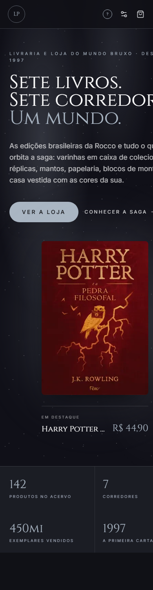
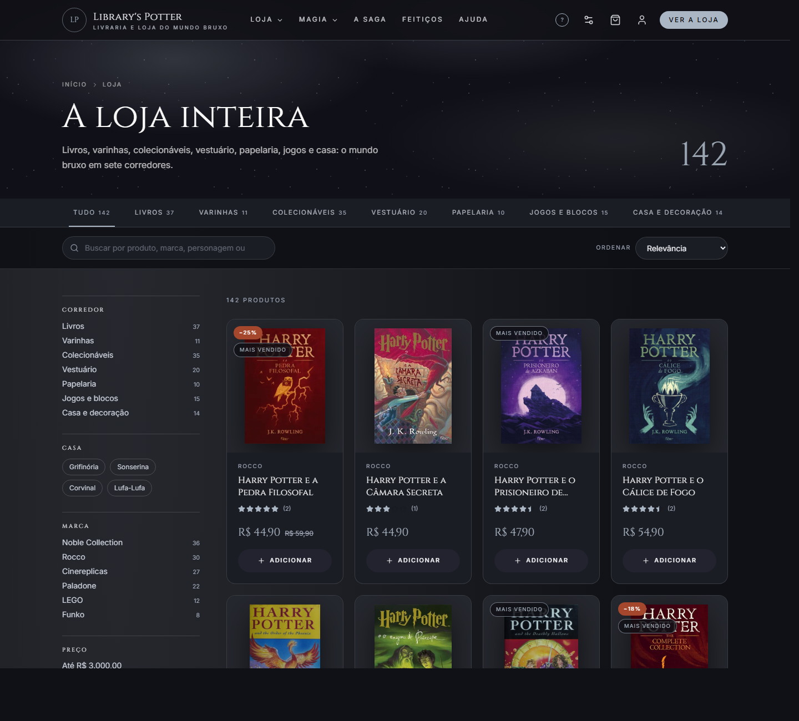
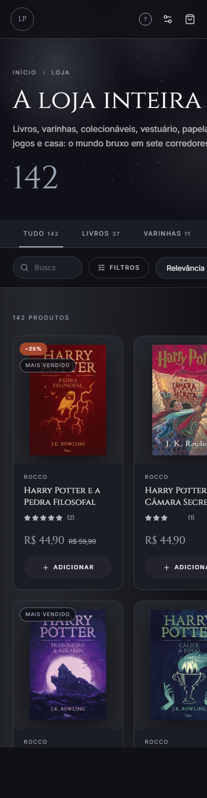
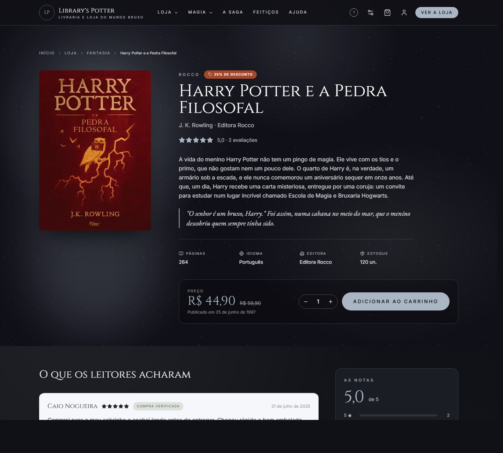
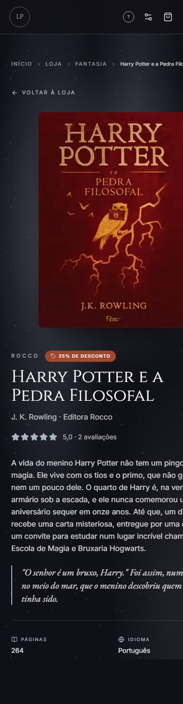

# Plano de testes — Library's Potter

Plano de testes do e-commerce Library's Potter, com os casos executados, o resultado de cada um e
os defeitos encontrados.

| | |
|---|---|
| **Autores** | Arthur Roberto Weege Pontes · Guilherme Silveira · Lucas Alves |
| **Versão** | 1.0 |
| **Data de execução** | 08/09/2026 |
| **Planilha de resultados** | [`resultados-dos-testes.csv`](resultados-dos-testes.csv) · [`resultados-dos-testes.xlsx`](resultados-dos-testes.xlsx) |
| **Documentos irmãos** | [Documentação](01-documentacao.md) · [Arquitetura](02-arquitetura.md) |

---

## 1. Objetivo

Verificar se o e-commerce funciona do cadastro ao pedido pago, se as transações são seguras e se a
loja é usável em celular e computador. O plano cobre as quatro frentes pedidas no trabalho:
funcional, integração, segurança e usabilidade/desempenho.

## 2. Escopo

**Coberto**

- Cadastro, login, logout, recuperação de senha e painel do cliente
- Busca, filtros, ordenação e página do produto
- Carrinho: adicionar, alterar quantidade, remover, limite de estoque e regra de frete
- Checkout completo: endereço, baixa de estoque, histórico e cancelamento
- Avaliações, chamados de suporte e painel administrativo
- Autenticação, autorização por papel, tratamento de dado sensível, injeção e limite de requisições
- Responsividade em oito larguras e tempo de carregamento das páginas principais

**Não coberto, e por quê**

| Item | Motivo |
|---|---|
| Transação real em gateway de pagamento | Não há gateway integrado. Ver seção 7 |
| Cotação de frete por CEP em transportadora | Não há integração com Correios ou Melhor Envio. Ver seção 7 |
| Entrega de e-mail transacional | Não há servidor de e-mail. Ver seção 7 |
| Certificado SSL em produção | O sistema roda em `localhost` sobre HTTP. O preparo para HTTPS foi verificado em SG-09 |
| Teste de carga com muitos usuários simultâneos | Fora do escopo do trabalho. A concorrência de estoque, que é o ponto crítico, tem teste automatizado |

## 3. Ambiente de teste

| Item | Versão |
|---|---|
| Sistema operacional | Windows 10 Home Single Language, 4 GB de RAM |
| Node.js | 22.15.0 |
| npm | 11.6.0 |
| PostgreSQL | 17.11, em `localhost:5432` |
| Fastify | 5.2.1 |
| Prisma | 6.2.1 |
| zod | 3.24.1 |
| React | 19.2.8 |
| Vite | 8.2.0 |
| Tailwind CSS | 4.3.3 |
| Vitest | 2.1.9 (backend) e 4.1.11 (frontend) |
| Google Chrome | 139.0.7258.157, em modo headless |

**Configuração da rodada.** O backend rodou em `http://localhost:3334` contra o banco
`librarys_potter` populado pelo seed: 142 produtos, 26 usuários, 71 avaliações, 39 pedidos e 12
chamados. O frontend foi compilado com `npm run build` e servido a partir do `dist/`, para as
medições de velocidade e responsividade valerem sobre o **build de produção**, e não sobre o
servidor de desenvolvimento. As suítes automatizadas rodaram contra o banco separado
`librarys_potter_test`.

## 4. Estratégia

Quatro níveis, do mais barato ao mais caro de rodar:

| Nível | Ferramenta | O que cobre |
|---|---|---|
| Unidade e integração de API | Vitest + `app.inject()` | 54 testes. Sobem a aplicação em memória, sem abrir porta, e batem no banco de teste de verdade |
| Componente e página | Vitest + Testing Library, com a API mockada | 42 testes. Renderizam a tela dentro dos cinco provedores e verificam o que o usuário vê |
| Ponta a ponta roteirizado | Script Node contra a API rodando | 50 chamadas HTTP numeradas, do cadastro ao cancelamento do pedido, com status e tempo anotados, mais as medições de tempo e a verificação do limite de requisições |
| Interface em várias telas | Chrome headless + DevTools Protocol | 7 páginas × 8 larguras = 56 medições de estouro horizontal, mais capturas de tela |

**Critério de entrada.** Banco criado e semeado, backend e frontend subindo sem erro, `/health`
respondendo 200.

**Critério de saída.** Nenhum defeito crítico ou grave em aberto; todo defeito encontrado
registrado com severidade, evidência e correção proposta.

**Classificação de severidade**

| Nível | Significado |
|---|---|
| Crítico | Impede a compra, corrompe dado ou expõe dado sensível |
| Grave | Quebra um fluxo importante, mas há caminho alternativo |
| Médio | Atrapalha a experiência sem impedir a tarefa |
| Baixo | Detalhe visual ou de texto |

---

## 5. Casos de teste e resultados

Legenda de status: **Passou** · **Falhou** · **Parcial** (funciona, mas não como o enunciado
descreve) · **N/A** (não aplicável ao ambiente) · **Não implementado**.

A coluna "Origem" diz como o caso foi verificado: `automatizado` (suíte que roda com `npm test`),
`roteiro` (script de chamadas HTTP reais executado nesta rodada) ou `medição` (Chrome headless).

### 5.1 Testes funcionais — cadastro e login

| ID | Caso | Resultado esperado | Obtido | Status | Origem |
|---|---|---|---|---|---|
| CT-01 | Criar conta nova com nome, e-mail e senha válidos | 201, token devolvido e cookie de sessão gravado | 201, token recebido, `Set-Cookie: token=...; HttpOnly; SameSite=Lax` | Passou | roteiro |
| CT-02 | Cadastrar com e-mail já existente | 409 com mensagem clara | 409 "Já existe uma conta com este e-mail." | Passou | roteiro |
| CT-03 | Cadastrar com e-mail inválido e senha de 3 caracteres | 400 apontando o campo errado | 400 `VALIDATION_ERROR` com `issues` por campo | Passou | roteiro |
| CT-04 | Cadastrar nos três papéis (leitor, fornecedor, suporte) | 201 nos três | 201 nos três | Passou | automatizado |
| CT-05 | Cadastrar com um papel inventado | 400 | 400 | Passou | automatizado |
| LG-01 | Entrar com e-mail e senha corretos | 200 com token | 200, token recebido | Passou | roteiro |
| LG-02 | Entrar com a senha errada | 401 sem dizer qual campo falhou | 401 "E-mail ou senha incorretos." | Passou | roteiro |
| LG-03 | Acessar o painel do cliente com sessão válida | 200 com o perfil | 200 com perfil e estatísticas | Passou | roteiro |
| LG-04 | Acessar o painel do cliente sem token | 401 | 401 "Sessão expirada ou inválida." | Passou | roteiro |
| LG-05 | Painel traz pedidos, avaliações e chamados do leitor | Contagens batem com o seed | Confere | Passou | automatizado |
| LG-06 | Sair da conta | 200 e cookie apagado | 200, `token=; Max-Age=0; Expires=1970` | Passou | roteiro |
| RS-01 | Pedir link de redefinição para e-mail cadastrado | 200 e token gerado, válido por 30 min | 200, token gerado | Passou | roteiro |
| RS-02 | Pedir link para e-mail **não** cadastrado | Mesma resposta do RS-01, para não revelar quem tem conta | Mesma mensagem e mesmo status | Passou | roteiro |
| RS-03 | Redefinir a senha usando o token | 200 | 200 | Passou | roteiro |
| RS-04 | Usar o **mesmo** link uma segunda vez | Recusa | 400 "Este link já foi utilizado." | Passou | roteiro |
| RS-05 | Entrar com a senha nova | 200 | 200 | Passou | roteiro |

### 5.2 Testes funcionais — busca e filtros

| ID | Caso | Resultado esperado | Obtido | Status | Origem |
|---|---|---|---|---|---|
| BF-01 | Listar o catálogo inteiro | Todos os produtos, com preço numérico | 142 produtos | Passou | roteiro |
| BF-02 | Buscar por nome ("pedra filosofal") | Traz o livro certo em primeiro | 8 resultados, o primeiro é "Harry Potter e a Pedra Filosofal" | Passou | roteiro |
| BF-03 | Buscar por ISBN (`9788532530783`) | Exatamente um resultado | 1 resultado | Passou | roteiro |
| BF-04 | Filtrar por departamento (`varinhas`) | Só varinhas | 11 produtos, igual à contagem do departamento | Passou | roteiro |
| BF-05 | Filtrar por faixa de preço R$ 50–100 e ordenar por preço | Nada fora da faixa, em ordem crescente | 30 itens, de R$ 52,90 a R$ 99,90, ordem conferida item a item | Passou | roteiro |
| BF-06 | Enviar um valor inexistente no filtro de tipo | 400, e não uma lista vazia silenciosa | 400 `VALIDATION_ERROR` | Passou | roteiro |
| BF-07 | Buscar por algo que não existe | 200 com lista vazia | 200, 0 produtos | Passou | roteiro |
| BF-08 | Abrir a página de um produto pelo slug | 200 com sinopse, notas e recomendações | 200 | Passou | roteiro |
| BF-09 | Abrir um slug que não existe | 404 | 404 | Passou | roteiro |
| BF-10 | Listar os departamentos com contagem | Soma das contagens = total do catálogo | livros 37, varinhas 11, colecionáveis 35, vestuário 20, papelaria 10, jogos 15, casa 14 = **142** | Passou | roteiro |
| BF-11 | Filtrar por casa e por marca | Resultados coerentes com o filtro | Confere | Passou | automatizado |
| BF-12 | Filtro na URL sobrevive ao recarregamento | A tela abre já filtrada | Confere | Passou | automatizado |

### 5.3 Testes funcionais — carrinho de compras

Produto usado: *Harry Potter e a Pedra Filosofal*, R$ 44,90, estoque 120.

| ID | Caso | Resultado esperado | Obtido | Status | Origem |
|---|---|---|---|---|---|
| CR-01 | Abrir o carrinho sem estar logado | 401 | 401 | Passou | roteiro |
| CR-02 | Carrinho de uma conta nova | Vazio, sem frete | 0 itens, frete R$ 0,00 | Passou | roteiro |
| CR-03 | Adicionar 1 item | Subtotal R$ 44,90, frete R$ 12,90, total R$ 57,80 | Exatamente isso | Passou | roteiro |
| CR-04 | Adicionar o **mesmo** produto de novo | Soma na mesma linha, não cria outra | 1 linha, quantidade 3 | Passou | roteiro |
| CR-05 | Alterar a quantidade para 8 (ultrapassa R$ 250) | Subtotal R$ 359,20 e **frete zerado** | Subtotal R$ 359,20, frete R$ 0,00 | Passou | roteiro |
| CR-06 | Pedir 7 unidades de um produto com estoque 6 | Recusa dizendo quanto há | 400 "Temos apenas 6 exemplar(es) em estoque." | Passou | roteiro |
| CR-07 | Pedir 99.999 unidades | Recusa pela regra de quantidade máxima (20) | 400 com `issues.quantity` | Passou | roteiro |
| CR-08 | Remover o item | Carrinho volta a zero | 200, 0 itens | Passou | roteiro |

### 5.4 Testes funcionais — processo de checkout

| ID | Caso | Resultado esperado | Obtido | Status | Origem |
|---|---|---|---|---|---|
| CK-01 | Fechar pedido com o carrinho vazio | Recusa | 400 "Seu carrinho está vazio." | Passou | roteiro |
| CK-02 | Fechar pedido sem endereço completo | 400 apontando cada campo faltando | 400 com `issues` em `address`, `city`, `state` e `zipCode` | Passou | roteiro |
| CK-03 | Fechar a compra do início ao fim | 201 com código legível e total correto | 201, pedido `LP-F4ZCH2`, status `PAID`, total R$ 102,70 (2 × 44,90 + 12,90) | Passou | roteiro |
| CK-04 | O estoque baixa no fechamento | 120 → 118 | 120 → 118 | Passou | roteiro |
| CK-05 | O carrinho esvazia no fechamento | 0 itens | 0 itens | Passou | roteiro |
| CK-06 | O pedido aparece no histórico | 1 pedido | 1 pedido | Passou | roteiro |
| CK-07 | Cancelar o pedido | Status vira `CANCELLED` | `CANCELLED` | Passou | roteiro |
| CK-08 | O cancelamento devolve o estoque | 118 → 120 | 118 → 120 | Passou | roteiro |
| CK-09 | Tentar abrir o pedido de outro leitor | 404, sem confirmar que o pedido existe | 404 | Passou | automatizado |
| CK-10 | Dois pedidos disputando o último exemplar | Só um passa; o outro é recusado e nada de estoque fica errado | Confere | Passou | automatizado |

### 5.5 Testes funcionais — avaliações, suporte e painel

| ID | Caso | Resultado esperado | Obtido | Status | Origem |
|---|---|---|---|---|---|
| AV-01 | Avaliar um produto e avaliar de novo | A segunda **edita** a primeira, não duplica | Confere | Passou | automatizado |
| AV-02 | Dar nota fora da escala de 1 a 5 | 400 | 400 | Passou | automatizado |
| AV-03 | Selo de compra verificada | Só para quem tem pedido com o produto | Confere | Passou | automatizado |
| AV-04 | Listar e apagar as próprias avaliações | Funciona só nas próprias | Confere | Passou | automatizado |
| SP-01 | Abrir chamado sem ter conta | Aceito, como na ajuda do site antigo | Confere | Passou | automatizado |
| SP-02 | Abrir chamado com descrição curta demais | 400 | 400 | Passou | automatizado |
| SP-03 | Abrir chamado logado | Chamado fica ligado à conta | Confere | Passou | automatizado |
| SP-04 | Ver e resolver a fila de chamados | Só o suporte consegue | Confere | Passou | automatizado |
| AD-01 | Leitor comum tentando entrar no painel | 403 | 403 | Passou | roteiro |
| AD-02 | Fornecedor cadastra e atualiza um produto | 201 e 200 | Confere | Passou | automatizado |
| AD-03 | Cadastrar produto com ISBN repetido | 409 | 409 | Passou | automatizado |
| AD-04 | Fornecedor tentando apagar um registro | 403; só o suporte apaga | Confere | Passou | automatizado |
| AD-05 | Apagar autor ou editora que ainda tem livros | Recusa | Confere | Passou | automatizado |
| AD-06 | Relatório de vendas | Faturamento, ticket médio, mais vendidos e estoque baixo | Confere | Passou | automatizado |
| AD-07 | Lista de usuários | Só para o suporte, e sem hash de senha | Confere | Passou | automatizado |

### 5.6 Testes de integração

| ID | Caso | Resultado esperado | Obtido | Status | Origem |
|---|---|---|---|---|---|
| IN-01 | Frete abaixo do limite de frete grátis | R$ 12,90 | R$ 12,90 no subtotal de R$ 44,90 | Passou | roteiro |
| IN-02 | Frete acima de R$ 250 | R$ 0,00 | R$ 0,00 no subtotal de R$ 359,20 | Passou | roteiro |
| IN-03 | Informar CEPs diferentes e ver valor e prazo mudarem | Valor e prazo por região | **O sistema não calcula frete por CEP.** A regra é fixa: R$ 12,90, grátis acima de R$ 250 | Não implementado | roteiro |
| IN-04 | O CEP informado é gravado no pedido | Endereço completo no pedido | `{recipient, address, city, state: "RJ", zipCode: "22220-000"}` | Passou | roteiro |
| IN-05 | Transação em gateway com cartão de teste ou PIX | Pedido aprovado pelo gateway | **Não há gateway.** O pedido nasce com status `PAID`; a tela de checkout avisa em texto que o pagamento é simulado | Não implementado | roteiro |
| IN-06 | Webhook de atualização de status do gateway | Status do pedido muda sozinho | **Rota não existe.** O status só muda por ação no painel ou por cancelamento do cliente | Não implementado | roteiro |
| IN-07 | E-mail de confirmação de compra | E-mail enviado ao fechar o pedido | **Não há envio de e-mail** | Não implementado | roteiro |
| IN-08 | E-mail de alteração de senha | Link chega por e-mail | O token é gerado, expira em 30 minutos, funciona uma vez só e foi validado ponta a ponta em RS-01 a RS-05. **Falta só a entrega por e-mail**: fora de produção o token volta na própria resposta | Parcial | roteiro |
| IN-09 | Integração com o banco no checkout | Baixa de estoque e criação do pedido na mesma transação, desfeitas juntas se algo falhar | Confere | Passou | automatizado |
| IN-10 | Integração frontend ↔ API | As telas consomem a API sem erro de contrato | 6 páginas carregadas do build de produção contra a API real, sem erro | Passou | medição |

### 5.7 Testes de segurança

| ID | Caso | Resultado esperado | Obtido | Status | Origem |
|---|---|---|---|---|---|
| SG-01 | Acessar `/cart` e `/orders` sem token | 401 nos dois | 401 nos dois | Passou | roteiro |
| SG-02 | Leitor comum acessando `/admin/users` e `/admin/books` | 403 nos dois | 403 nos dois | Passou | roteiro |
| SG-03 | Usar um token adulterado | 401 | 401 | Passou | roteiro |
| SG-04 | Procurar o hash da senha nas respostas | Nunca aparece | Nenhuma resposta de cadastro, login, perfil ou lista de usuários contém o hash | Passou | roteiro |
| SG-05 | Conferir como a senha está guardada no banco | Hash forte, nunca texto puro | `$2a$10$...`, bcrypt custo 10, 60 caracteres | Passou | roteiro |
| SG-06 | Injeção de SQL no campo de busca (`' OR 1=1 --`) | Tratado como texto, sem erro e sem vazamento | 200 com 0 resultados. O Prisma parametriza toda consulta | Passou | roteiro |
| SG-07 | Cabeçalhos de segurança | Helmet ativo | `X-Frame-Options: SAMEORIGIN`, `X-Content-Type-Options: nosniff`, `Strict-Transport-Security: max-age=31536000; includeSubDomains`, `X-DNS-Prefetch-Control: off`, `X-Download-Options: noopen`, `X-Permitted-Cross-Domain-Policies: none`, `Referrer-Policy: no-referrer` | Passou | roteiro |
| SG-08 | Dado de cartão visível na tela ou no código-fonte | Não deve existir | Não existe campo de cartão em formulário nenhum nem coluna no banco. O checkout avisa em texto que nenhum dado de cartão é pedido | Passou | roteiro |
| SG-09 | HTTPS ativo em todas as páginas | Certificado válido | **Não aplicável**: o sistema roda em `localhost` sobre HTTP. O preparo existe: HSTS já é enviado e o cookie de sessão recebe `Secure` quando `NODE_ENV=production` | N/A | roteiro |
| SG-10 | Cookie de sessão | `HttpOnly` e `SameSite` | `HttpOnly; SameSite=Lax; Max-Age=604800` | Passou | roteiro |
| SG-11 | Limite de requisições contra força bruta | Bloqueio depois de um teto | 429 exatamente na requisição 200, com `Retry-After: 60` | Passou | roteiro |
| SG-12 | Onde o token fica no navegador | Guardado de forma segura | O JWT fica **também** em `localStorage`, além do cookie `HttpOnly`. Ver DEF-02 | Observação | roteiro |

### 5.8 Testes de usabilidade e desempenho

**UD-01 — Responsividade.** Sete páginas medidas em oito larguras (360, 390, 414, 768, 1024, 1280,
1440 e 1920 px) com Chrome headless, perguntando à própria página se o documento ficou mais largo
que a janela.

| Página | 360 | 390 | 414 | 768 | 1024 | 1280 | 1440 | 1920 |
|---|---|---|---|---|---|---|---|---|
| Home | ok | ok | ok | ok | ok | ok | ok | ok |
| **Catálogo** | **+29 px** | **+15 px** | **+3 px** | ok | ok | ok | ok | ok |
| Produto | ok | ok | ok | ok | ok | ok | ok | ok |
| Carrinho | ok | ok | ok | ok | ok | ok | ok | ok |
| Login | ok | ok | ok | ok | ok | ok | ok | ok |
| Cadastro | ok | ok | ok | ok | ok | ok | ok | ok |
| Ajuda | ok | ok | ok | ok | ok | ok | ok | ok |

55 das 56 combinações passaram. O catálogo abaixo de 420 px empurra a página para o lado: é o
**DEF-01**, descrito na seção 6.

As mesmas três páginas, no computador (1440 px) e no celular (390 px), tiradas do build de
produção:

| Computador | Celular |
|---|---|
|  |  |
|  |  |
|  |  |

Na captura do catálogo em 390 px dá para ver o DEF-01: o cabeçalho e os cartões passam da borda
direita da tela.

**UD-02 — Velocidade das páginas.** Build de produção servido localmente, três rodadas por página.
A primeira rodada é o cache frio.

| Página | 1ª rodada | 2ª | 3ª | Peso baixado |
|---|---|---|---|---|
| Home | 476 ms | 91 ms | 108 ms | 523 KB |
| Catálogo | 242 ms | 183 ms | 90 ms | 624 KB |
| Produto | 283 ms | 80 ms | 136 ms | 521 KB |
| Carrinho | 42 ms | 34 ms | 66 ms | 510 KB |
| Checkout | 58 ms | 73 ms | 50 ms | 510 KB |
| Login | 37 ms | 32 ms | 34 ms | 510 KB |

O pior caso foi 476 ms, contra o limite de 3 segundos do RNF-01. Os pesos são **sem compressão**,
porque o servidor de medição não comprime; com o gzip que o build reporta, o casco inicial cai de
510 KB para cerca de 150 KB.

**UD-03 — Velocidade da API.** 15 chamadas por rota.

| Rota | Mínimo | Mediana | Máximo |
|---|---|---|---|
| `GET /health` | 1 ms | 2 ms | 3 ms |
| `GET /catalog/books` (142 produtos) | 18 ms | 25 ms | 38 ms |
| `GET /catalog/books?department=livros` | 10 ms | 12 ms | 15 ms |
| `GET /catalog/books/:slug` | 10 ms | 15 ms | 42 ms |
| `GET /catalog/departments` | 2 ms | 3 ms | 5 ms |

**UD-04 — Peso do build.** O `npm run build` gera 38 arquivos. O casco inicial é de 5 arquivos
(510 KB, ~150 KB com gzip) e cada página vem em um arquivo próprio, carregado sob demanda: a Saga,
que é a página mais pesada com 119 KB, não é baixada por quem vai direto ao catálogo.

**UD-05 — Fundamentos de página.** `<html lang="pt-BR">`, `<meta name="viewport"
content="width=device-width, initial-scale=1.0">`, `<title>` e `<meta name="description">`
presentes. 26 dos 54 arquivos `.tsx` de `src/` usam classes responsivas de breakpoint.

**UD-06 — Acessibilidade.** As sete preferências de leitura (modo de visão para daltonismo, alto
contraste, tema claro, tamanho de texto, fonte legível, sublinhado de links e movimento reduzido)
são gravadas no navegador e reaplicadas na visita seguinte; um armazenamento corrompido é ignorado
em vez de derrubar a loja. 11 testes automatizados cobrem esse comportamento.

---

## 6. Defeitos encontrados

### DEF-01 — O catálogo estoura para o lado em telas de celular

| | |
|---|---|
| **Severidade** | Médio |
| **Onde** | `frontend/src/components/catalog/ProductCard.tsx:166` |
| **Aparece em** | Página `/catalogo`, telas com menos de ~420 px |
| **Situação** | Aberto |

**O que acontece.** Abaixo de 420 px a página do catálogo fica mais larga que a tela e ganha uma
barra de rolagem horizontal: 389 px de conteúdo numa tela de 360, 405 px numa tela de 390 e 417 px
numa de 414. O usuário consegue arrastar a loja para o lado, e o cabeçalho fixo se estica junto.

**Causa.** A linha de preço do cartão de produto é um `flex` sem quebra:

```tsx
<div className="flex items-baseline gap-2">
  <span className="font-display text-xl text-house-accent">{formatPrice(book.price)}</span>
  {book.compareAtPrice && book.compareAtPrice > book.price && (
    <span className="text-xs text-chalk-300 line-through">{formatPrice(book.compareAtPrice)}</span>
  )}
</div>
```

Quando o produto está em promoção e o preço de tabela é longo — o pior caso medido é o LEGO
Castelo de Hogwarts, com `R$ 3.299,90` riscado ao lado de `R$ 2.499,90` —, os dois preços somados
não cabem na coluna do grid de duas colunas. Como a linha não quebra nem encolhe, ela empurra o
cartão, o cartão empurra o grid e o grid empurra a página. O cabeçalho é consequência, não causa:
sendo `fixed inset-x-0`, ele se estica até a largura do documento depois que outra coisa a
aumentou.

**Como reproduzir.** Abrir `/catalogo` numa tela de 360 px e arrastar para a direita; ou, no
console, `document.documentElement.scrollWidth > document.documentElement.clientWidth`.

**Correção proposta.** Deixar a linha quebrar e o texto encolher: `flex-wrap` no contêiner e
`min-w-0` no preço. Uma alternativa é esconder o preço de tabela no cartão abaixo de `sm`,
mantendo-o na página do produto — mas isso tira do celular a informação de desconto, que é o que
decide a compra.

### DEF-02 — O JWT também fica no `localStorage`

| | |
|---|---|
| **Severidade** | Baixo neste contexto |
| **Onde** | `frontend/src/lib/api.ts:42-46` |
| **Situação** | Aberto, com justificativa |

**O que acontece.** A sessão é gravada em dois lugares: o cookie `HttpOnly` que o servidor manda e
uma cópia em `localStorage`, que o cliente da API lê para montar o cabeçalho `Authorization`. O
cookie é o mecanismo seguro — script de página não o alcança. A cópia no `localStorage`, sim: um
XSS conseguiria ler o token e usar a sessão de quem estiver logado.

**Por que a severidade é baixa aqui.** O site não renderiza HTML vindo do usuário: comentário de
avaliação e descrição de chamado entram como texto no React, que escapa por padrão. Sem um ponto de
XSS, não há como ler o token.

**Correção proposta.** Passar a usar só o cookie `HttpOnly`, tirando o `Authorization` do cliente e
o `localStorage` do meio. O backend já aceita as duas formas: o `@fastify/jwt` está registrado com
`cookie: { cookieName: 'token' }`, então a troca é do lado do frontend.

---

## 7. Lacunas e caminho de implementação

Três itens do enunciado não têm contrapartida no sistema. Nenhum é um defeito — são escolhas de
escopo de um trabalho acadêmico —, mas vale registrar o que seria preciso para fechá-los.

### 7.1 Cálculo de frete por CEP

Hoje: `cart-service.ts` aplica R$ 12,90, ou R$ 0,00 acima de R$ 250. O CEP é coletado no checkout e
gravado no pedido, mas não entra na conta.

Para implementar: criar `POST /checkout/shipping` recebendo o CEP e os itens, e um
`shipping-service.ts` que consulte a API do Melhor Envio ou dos Correios e devolva as opções com
valor e prazo. O peso e a dimensão de cada produto precisariam entrar como colunas em `books` — hoje
não existem. A regra atual viraria o caso alternativo para quando a transportadora não responder.

### 7.2 Gateway de pagamento

Hoje: o pedido nasce com status `PAID` e o checkout avisa em texto que o pagamento é simulado.

Para implementar: no `CreateOrderService`, criar o pedido como `PENDING` e chamar o gateway
(Mercado Pago ou Stripe) para gerar a preferência de pagamento, devolvendo a URL ou o QR do PIX.
Depois, criar `POST /orders/webhook` — rota pública, mas com a assinatura do gateway conferida —
para receber a confirmação e mover o pedido de `PENDING` para `PAID`. O enum `OrderStatus` já tem
os dois estados; falta quem os mude.

Um ponto de projeto que já está resolvido e ajudaria aqui: o estoque é baixado dentro da transação
do fechamento. Com pagamento real, essa baixa passaria a ser uma reserva, desfeita se o pagamento
não confirmar dentro de um prazo.

### 7.3 E-mails transacionais

Hoje: nenhum e-mail é enviado. O token de redefinição volta na resposta da API fora de produção.

Para implementar: um `mail-service.ts` com Nodemailer ou Resend, chamado em três pontos — depois do
cadastro (boas-vindas), depois do fechamento do pedido (confirmação com o código `LP-XXXXXX`) e no
`forgot-password` (o link). O `ForgotPasswordController` já tem o comentário marcando exatamente
onde a chamada entra, e a resposta ao cliente não mudaria: ela já é a mesma para e-mail cadastrado
e não cadastrado.

---

## 8. Resumo

| Categoria | Casos | Passou | Parcial | N/A | Não implementado | Observação |
|---|---|---|---|---|---|---|
| Funcionais — cadastro e login | 16 | 16 | – | – | – | – |
| Funcionais — busca e filtros | 12 | 12 | – | – | – | – |
| Funcionais — carrinho | 8 | 8 | – | – | – | – |
| Funcionais — checkout | 10 | 10 | – | – | – | – |
| Funcionais — avaliações, suporte e painel | 15 | 15 | – | – | – | – |
| Integração | 10 | 5 | 1 | – | 4 | – |
| Segurança | 12 | 10 | – | 1 | – | 1 |
| Usabilidade e desempenho | 6 | 5 | 1 | – | – | – |
| **Total** | **89** | **81** | **2** | **1** | **4** | **1** |

**Testes automatizados.** 96 no total, todos passando: 54 de API (4 suítes, 91,5 s) e 42 de
interface (5 suítes, 70,2 s).

```
backend  → Test Files 4 passed (4) | Tests 54 passed (54)
frontend → Test Files 5 passed (5) | Tests 42 passed (42)
```

**Defeitos em aberto.** Um médio (DEF-01, estouro horizontal do catálogo no celular) e um baixo
(DEF-02, JWT no `localStorage`). Nenhum crítico ou grave, o que atende ao critério de saída da
seção 4.

**Conclusão.** O fluxo de compra funciona do cadastro ao cancelamento do pedido, com o estoque
correto em todos os pontos medidos. As regras de acesso por papel seguram todas as tentativas
testadas. O desempenho fica com folga larga em relação ao exigido: 476 ms no pior caso, contra o
limite de 3 segundos. O que falta para o sistema virar uma loja de verdade não é correção, e sim
integração — pagamento, frete e e-mail, com o caminho descrito na seção 7.
